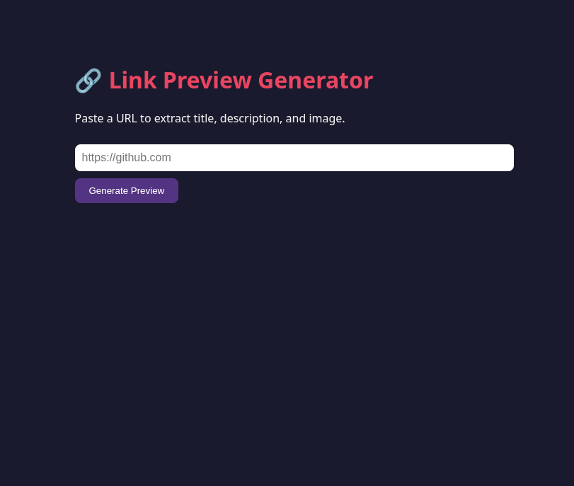

# Link Preview Generator

A lightweight Node.js/TypeScript service that extracts website metadata (title, description, image, and site name) from any URL. This project demonstrates Docker multi-stage builds for creating optimized production images.

## Features

- Extract website title, description, image, and site name
- Returns metadata as JSON
- Browser-based UI for testing
- Optimized production image using Docker multi-stage builds

## Docker Concepts Practiced

- Multi-stage Docker builds
- TypeScript compilation
- Image size optimization
- Production-only dependencies
- `.dockerignore` best practices

## Image Size Comparison

| Stage | Base Image | Size |
|--------|------------|------|
| Build | `node:20` | ~1.2 GB |
| Runtime | `node:20-alpine` | ~246 MB |

## Screenshots

### Home Page



### YouTube Link Preview


### GitHub Link Preview


## Project Structure

```
.
├── src/
├── dist/
├── screenshots/
│   ├── home.png
│   ├── youtube-preview.png
│   └── github-preview.png
├── Dockerfile
├── package.json
├── tsconfig.json
└── README.md
```

## Quick Start

```bash
docker build -t link-preview:latest .

docker run -d \
  --name preview \
  -p 3000:3000 \
  link-preview:latest
```

Open your browser and visit:

```
http://localhost:3000
```

## Tech Stack

- Node.js
- TypeScript
- Docker

## Author

**Muneeb Ahmad Rather**